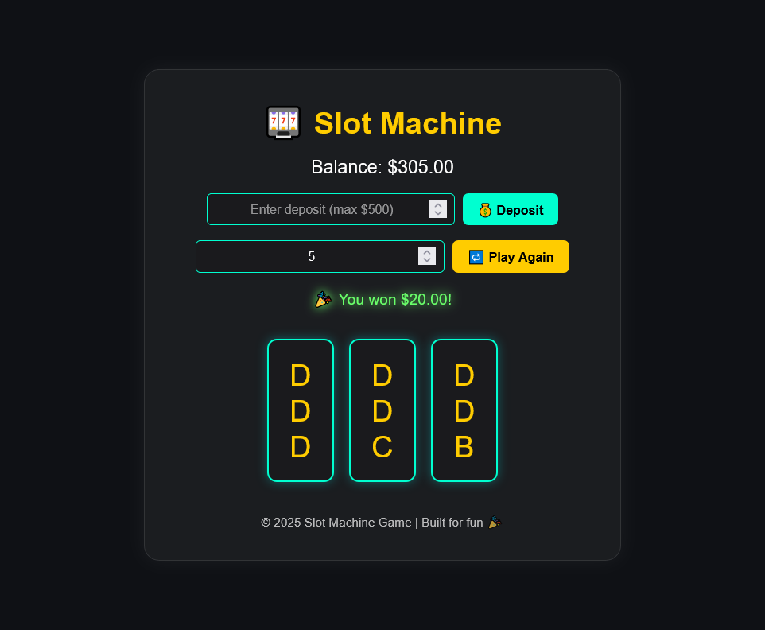

# 🎰 Slot Machine Web App

A **modern, responsive slot machine** built entirely with **HTML, CSS, and JavaScript**.  
Sleek, mobile-friendly, and optimized for SEO — spin to test your luck!

---

## 🖼️ Screenshot



> 💡 If the image above doesn’t appear, make sure your screenshot file is named **`screenshot.png`**  
> and located inside an **`images/`** folder at your project root.  
> Example:
> ```
> /index.html  
> /app.js  
> /style.css  
> /images/screenshot.png  
> ```

> If you haven’t added it yet, here’s a temporary placeholder you can use instead:
> 

---

## ✨ Features

- 🎨 Sleek, modern design with CSS animations  
- 🧠 Accurate win detection (fixed “DDD” logic bug)  
- 💰 Adjustable lines and bet amounts  
- 🔊 Optional sound effects: spin, win, and lose  
- 📱 Fully responsive and mobile-optimized  
- ⚙️ SEO-optimized with semantic HTML structure  

---

## 🚀 Setup

1. **Clone or download** this repository.  
2. Open `index.html` directly in your browser.  
3. Adjust **Lines** and **Bet per Line**.  
4. Press **SPIN 🎡** to play and test your luck!

---

## 🛠️ Tech Stack

- **HTML5** — semantic, SEO-friendly markup  
- **CSS3** — modern responsive layout and animations  
- **JavaScript (ES6)** — fully interactive game logic  

---

## 📂 Project Structure

