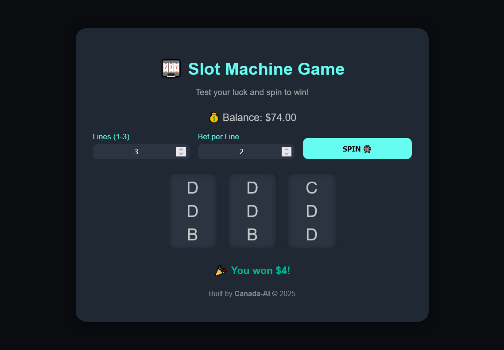

        # 🎰 Slot Machine Web App

A **modern, responsive slot machine** built entirely with **HTML, CSS, and JavaScript**.

# 🎰 Slot Machine Web App

A **modern, responsive slot machine** built entirely with **HTML, CSS, and JavaScript**.  
Sleek, mobile-friendly, and optimized for SEO — spin to test your luck!

---

## 🖼️ Screenshot

> *(Add your screenshot here — e.g., `screenshot.png`)*  
> You can include one by saving an image inside the project root and linking it below:

```md



## ✨ Features
- 🎨 Sleek, marketable design with smooth animations
- 🧠 Accurate win logic (fixed DDD and similar bugs)
- 💰 Adjustable lines and bet amounts
- 🔊 Optional sound effects (spin, win, lose)
- 📱 Fully responsive and mobile-friendly
- ⚙️ SEO-optimized and accessible

## 🚀 Setup
1. Clone or download this repository.
2. Open `index.html` in your browser.
3. Adjust lines and bet values.
4. Click **SPIN** to play!

## 🛠️ Tech Stack    
- **HTML5** — semantic, SEO-ready structure  
- **CSS3** — modern responsive styling  
- **JavaScript (ES6)** — dynamic game logic  

## 📂 Optional Assets
You can add sound files inside an `/assets` folder:


## 📜 License
MIT © 2025 — Built by Mwihaki Githii /
